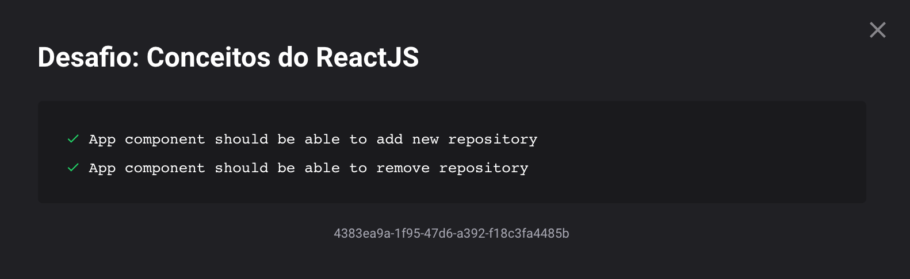

<h1 align="center">
  Challenge 02 - Course GoStack
</h1>

## What is dealt with in the challenge?

This challenge is about Concepts of ReacrJS

## What does the exercise aks for?

Now that you have the template cloned, and ready to continue, you must open the src / App.js file, and complete where you don't have code with the code to achieve the objectives of each feature.

```List the repositories for your API```: You should be able to create a list with the title field of all the repositories that are registered in your API.

```Adding a repository to your API```: You should be able to add a new item to your API via a button with the text Add and, after creation, you should be able to display its name after registration.

```Remove a repository from your API```: For each item on your list, you must have a button with the text Remove which, when clicked, will call a function to remove that item from the list of your frontend and your API.

## Does Gui made it?

After sooo many attempts, yes! :)

Here's my results:



